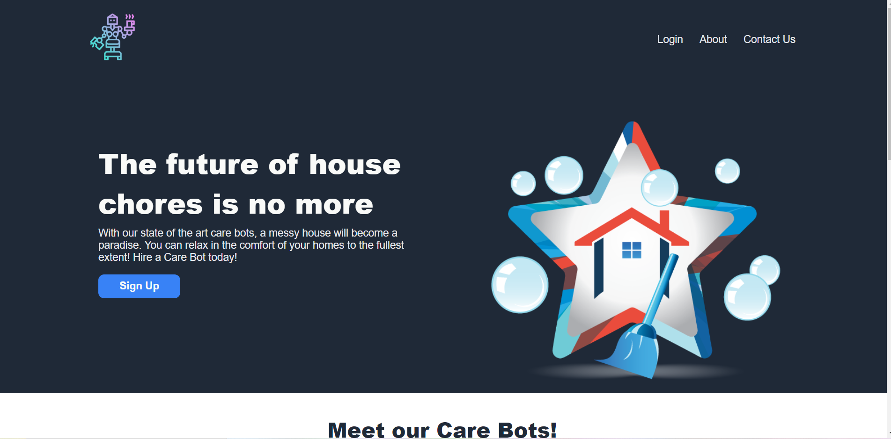

# About 
This repo contains the files for my first front end webpage design with HTML and CSS. The layout is a landing page based on the image provided by the Odin Project foundations course which can be found at: https://www.theodinproject.com/lessons/foundations-landing-page. My idea for this was to design a website that allows people to hire robots that can help clean their house. These robots are called "Care Bots". My site follows most of the template provided by the Odin Project. However, I did change some minor details due to design preferences.

# Reflection 
As this was my first full front end webpage project, I did encounter some trouble in the design process. I believe that my HTML and CSS code could be improved for cleanliness and readability. There may have been times where I added code that was unnecessary. Furthermore, there are some code in my script that I am not entirely sure what their purpose. However, due to their ability to satisfy the vision of my site, I decided to keep them. Despite all of this, I am extremely proud of this project. I believe that my final site turned out great. It is aesthetically pleasing and meets all of the requirements from the Odin Project course. In the future, I will go back and revise my code and potentially improve the design of the website when I develop my skills even more. Below is an image of the top of my website.

# Images

